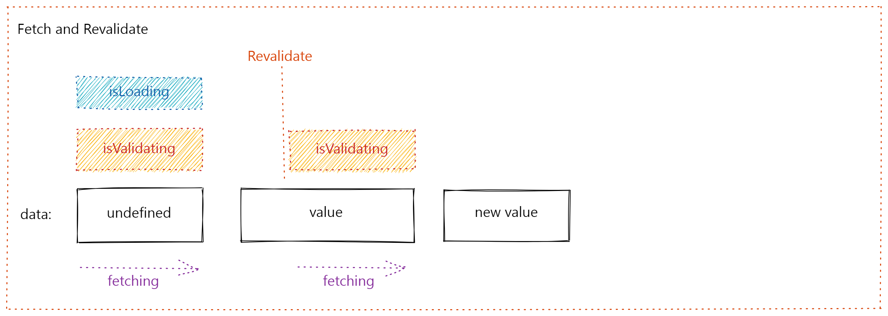
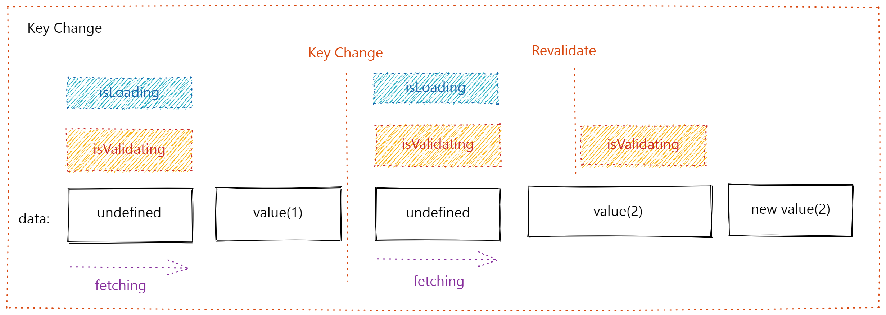
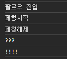

# [DailyPic](https://daily-pic.vercel.app)

- 배포: https://daily-pic.vercel.app

# 프로젝트 소개

## 제작 이유

- Next.js를 활용한 instagram 클론 코딩.
- 수강 강의 : [드림코딩 - Next.js](https://academy.dream-coding.com/courses/next)

## 기능 목록

- 팔로잉한 유저 게시글 보여주기
- 팔로잉한 유저 상단에 보여주기
- 유저 게시글
  - 좋아요, 북마크 기능
  - 댓글 작성 기능
  - 클릭 시 게시글 상세 모달
- 게시글 상세
  - 모달창 구현 (createPotal)
  - 좋아요, 북마크, 댓글 작성 기능
  - 댓글 전체 조회 기능
- 유저 검색
  - 아이디, 이름 모두 검색 가능 (debounce)
- 신규 게시글 작성
  - 이미지 업로드 (클릭/드래그 앤 드랍)
- 유저 마이페이지
  - 팔로잉/언팔로잉 기능 (server caching, useTransition, router.refresh)
  - 작성한 게시글 보여주기
  - 북마크/좋아요 한 게시글 보여주기
  - 게시글 클릭 시 게시글 상세 모달 (swr - keyCache)
- 구글/깃허브 소셜 로그인 (next-auth)
- 인증되지 않은 사용자는 로그인 창으로 이동 (middleware)
- 인터렉션 적용 (swr - mutate, optimisticData)
- 데이터 페칭 로딩바 (react-spinners, swr)
- 반응형 UI 적용

- 서버 : Sanity (GROQ query language)

## 사용 기술

<p>
  
  
  
  
  
</p>

## 배운 점

### 1. Headless CMS

#### CMS ?

- CMS (Contents Management System) : 디지털 콘텐츠를 관리하기 위해 사용하는 시스템이다. 웹사이트를 빠르게 구축할 수 있도록 도와주며, 워드프레스가 이에 속한다.
  하지만 CMS는 서비스와 콘텐츠가 연결되어있어 구조를 변경하기 힘들며, 확장하기가 힘들었다. 그래서 나온 것이 Headless CMS이다.

#### Headless CMS

- Headless CMS : 말 그대로 머리가 없는 CMS인데, 여기서 '머리'는 사용자가 마주하는 화면인 프론트엔드 환경이다. 즉, 백엔드만 있는 콘텐츠(데이터) 관리 시스템이다. Headless CMS는 ui에 관여하지 않고, api를 통해 통신하므로, 콘텐츠는 그대로 제공하면서 head, 프론트엔드 프레임워크를 자유롭게 변경할 수 있다.

#### Sanity

이 프로젝트에는 Headless CMS로 Sanity를 사용하였다.
Sanity는 Sanity Studio 라는 관리자 페이지를 제공하고, 콘텐츠는 Content Lake에 보관한다.
Sanity는 쿼리 언어로 GROQ (Graph-Relational Object Queries)를 사용한다.

- 동작 Flow : FE가 요청을 보내면, BE가 요청을 받아, Content Lake의 데이터를 받아와 FE로 응답을 보내는 flow이다.

---

### 2. SWR

#### 2-1. SWR ? (stale-while-revalidate)

캐시(stale)로부터 데이터를 반환한 후, fetch 요청(revalidate)을 하고, 최종적으로 최신화된 데이터를 가져오는 전략입니다.

#### 2-2. Fetch & Revalidate



1. 초기에는 data = undefined, isLoading = true, isValidating = true 상태.
2. 데이터를 받아오면, data = value, isLoading = false, isValidating = false.
3. 데이터가 요청이 오면, UI 상에는 일단 SWR에 캐싱이 된 데이터를 보여준다.
4. 동시에, 서버로부터 데이터를 받아오는데, 그 상태가 isValidating = true 이다.
5. 서버에서 데이터를 받아오면 UI 상의 data에도 new value를 보여주고, SWR에도 new value를 캐싱한다.

#### 2-3. Key Change



1. 초기에는 key가 1인 데이터를 받아온다.
2. 데이터 요청이 오는데, 만약 key가 2로 다르다면, 초기 상태처럼 data = undefined, isLoading = true, isValidating = true 상태가 된다.
3. 그 후 동일 키로 데이터 요청이 온다면 revalidate와 동일한 flow를 거치게 된다.

- 관련 링크 : [Understanding SWR](https://swr.vercel.app/ko/docs/advanced/understanding)

#### 2-4. mutate

SWR에 데이터를 변경하기 위해서는 mutate api를 사용해야 하는데, mutate api에는 두 가지가 있다.

1. global mutate
   - 모든 키를 mutate 할 수 있다.
   - 데이터가 변경을 하기 위한 통신, 변경된 데이터를 받아오기 위한 통신, 총 2번을 서버와 통신하기 때문에, 속도가 느리다.
2. bound mutate
   - 현재 키를 기반으로 빠르게 mutate 할 수 있다.
   - 데이터 변경을 함과 동시에, 변경된 데이터를 받아온다. 1번에 모든 작업이 끝나기 때문에 global mutate보다 빠르다.
   - option으로 optimisticData에 최종 데이터를 미리 작성한다면, 서버에 다녀오기 전에 이미 UI상으로 빠르게 변경된 데이터를 보여줄 수 있으므로, UX가 좋아진다.
   ```typscript
   mutate(fetcher(key, { arg }), {
       optimisticData: newData, // 새로운 데이터로 즉시 업데이트
       populateCache: false, // mutate 결과를 반환
       revalidate: false,  // 캐시 유효성 재검사
       rollbackOnError: true,  // 오류 발생시 캐시 롤백
     });
   ```
   - 해당 코드에서는 새로운 데이터를 정의하여 즉시 업데이트 하고, 서버의 데이터와 해당 데이터가 동일하다는 것이 명백하기 때문에 revalidate를 하지 않는다.

---

### 3. [Next.js] context를 서버 컴포넌트에서 사용하기

- 자식 컴포넌트까지 클라이언트 컴포넌트가 될지 안될지의 여부는 단순히 DOM tree 구조로 결정되는 것이 아니다.
  - import하고 사용을 하는 경우에는 상위 컴포넌트가 클라이언트라면 클라이언트 컴포넌트가 되지만, (만약 이 경우에는, 하위 컴포넌트에서 'use client' 선언은 생략하여도 됨 => 클라이언트 컴포넌트 진입점에서만 'use client'를 사용하면 된다.)
  - children으로 받은 경우에는 상위 컴포넌트가 클라이언트여도 서버 컴포넌트로 사용할 수 있다.
- <AuthContext>는 클라이언트 컴포넌트지만, children prop으로 자식을 전달받기 때문에 자식은 자동적으로 클라이언트 컴포넌트가 되지 않음.
- 관련 링크 : [Next.js - Supported Pattern: Passing Server Components to Client Components as Props](https://nextjs.org/docs/app/building-your-application/rendering/composition-patterns#supported-pattern-passing-server-components-to-client-components-as-props)

---

### 4. Debounce vs Throttle

- 키워드 검색 시, 이벤트가 생길 때 마다 네트워크 요청을 하게 되는데, 그렇게 되면 서버에 부하가 올 수 있다. debounce, throttle 같은 기능을 적용해 최적화한다.
- _debounce_ : 마지막 이벤트 후 정해진 시간이 지나면 요청함.
- _throttle_ : 정해진 시간 간격으로 요청함.
- 관련 링크
  - [swr - debounce issue](https://github.com/vercel/swr/issues/110)
  - [debounce vs throttle](https://redd.one/blog/debounce-vs-throttle)

---

### 5. [Next.js] `dynamic = 'force-dynamic'`

- ssg로 빌드된 화면을 ssr로 처리하고 싶을 때 force-dynamic을 사용하면 된다.
- api의 get에 별도의 request를 전달받지 않는 경우, request에 따라 변경되는 데이터가 없기 때문에 SSG로 빌드된다.
- 관련 링크 : [Next.js - Route Segment Config](https://nextjs.org/docs/app/api-reference/file-conventions/route-segment-config)

---

### 6. [Next.js] dynamic route의 metadata와 cache

- dynamic route의 경우에 generateMetadata 함수를 사용하여 동적으로 메타데이터를 생성할 수 있다.
- 이 때, 파라미터로 동일한 api를 호출할 경우, nextjs에서 제공하는 cache로 api를 한 번만 호출하면, 그 뒤로는 캐시된 데이터를 전달할 수 있다.

```typescript
// src\app\[username]\page.tsx

const getUser = cache(async (username: string) => getUserProfile(username));

export default async function UserpageLayout({ params: { username } }: Props) {

  ...
  const user: ProfileUser = await getUser(username);
  ...

}

export async function generateMetadata({ params: { username } }: Props) {
  const user = await getUser(username);
  ...
}

```

---

### 7. [NextAuth.js] jwt callback

- jwt 콜백으로 토큰 아이디에 유저 아이디를 넣어주면, session 콜백에서 token.sub로 id를 가져올 수 있다.
- 관련 링크 : [NextAuth.js - JWT callback](https://next-auth.js.org/configuration/callbacks#jwt-callback)

```typescript

export const authOptions: NextAuthOptions = {
  ...,
  callbacks: {
    ...
    async session({ session, token }) {
      const user = session?.user;
      if (user) {
        session.user = {
          ...user,
          id: token.sub || '', // 유저 id를 넣은 jwt token에서 id 꺼내옴.
        };
      }
      return session;
    },
    async jwt({ user, token }) {
      if (user) {
        token.uid = user.id; // jwt 토큰에 유저 id 넣음
      }
      return token;
    },
    ...
  },
};

```

---

### 8. [React] createPortal을 활용하여 modal 창 구현

- createPortal : 일부 자식 요소를 DOM의 다른 부분으로 렌더링을 해 주는 기능이며, react에서 제공하는 api이다.
- 사용법 : 다른 DOM에서 렌더링, 모달 기능, 리액트가 아닌 서버 마크업/ 리액트가 아닌 DOM에서 렌더링 할 때 사용한다.
- 관련 링크 : [React - createPortal](https://react.dev/reference/react-dom/createPortal)

#### `createPortal(children, domNode, key?)`

- `children` : 렌더링 할 자식 요소
- `domNode` : 렌더링 할 위치
- `key` : 고유한 키 값

### 9. [React] useTransition

- useTransition : UI를 막지 않고 상태를 업데이트 할 수 있게 해주는 기능이며, react에서 제공하는 api이다.
- 사용법 : 렌더링 시간이 긴 작업을 수행하는 중에 다른 작업을 수행할 수 있다.
- 프로젝트에서는 `router.refresh`와 함께 사용하였다.
- `router.refresh` : 현재 경로에 대하여 서버에 새로운 요청이 생성되어, 브라우저 상태를 유지하며 "새로고침"한다.

  ```typescript
  // src\component\userpage\FollowButton.tsx
  ...
  const router = useRouter();
  const [isPending, startTransition] = useTransition();
  const [isFetching, setIsFetching] = useState(false);
  const isUpdating = isPending || isFetching;

  const isShow = user && user.username !== username;
  const isFollowing =
    user &&
    user.following.find(
      (followingUser: SimpleUser) => followingUser.username === username
    );

  const handleFollow = async () => {  // 팔로우 버튼을 누르면
    console.log('팔로우 진입')
    setIsFetching(true);  // 페칭 상태 진입
    console.log('페칭시작')
    user && (await toggleFollow(id, !isFollowing)); // 데이터 mutate
    setIsFetching(false); // 페칭 상태 해제
    console.log('페칭해제')
    startTransition(() => { // 상태가 업데이트 되면
      console.log('???')
      router.refresh(); // 새로 고침
      console.log('!!!!')
    });
  };
  ...
  ```

  
